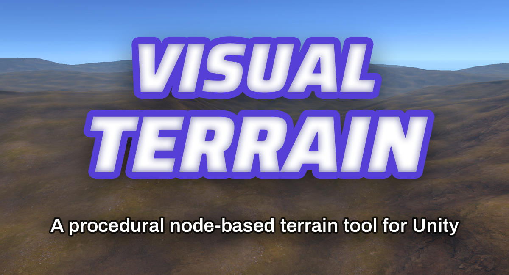
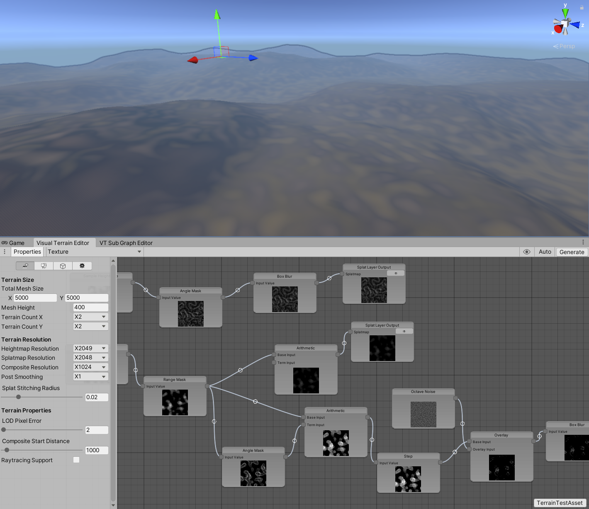
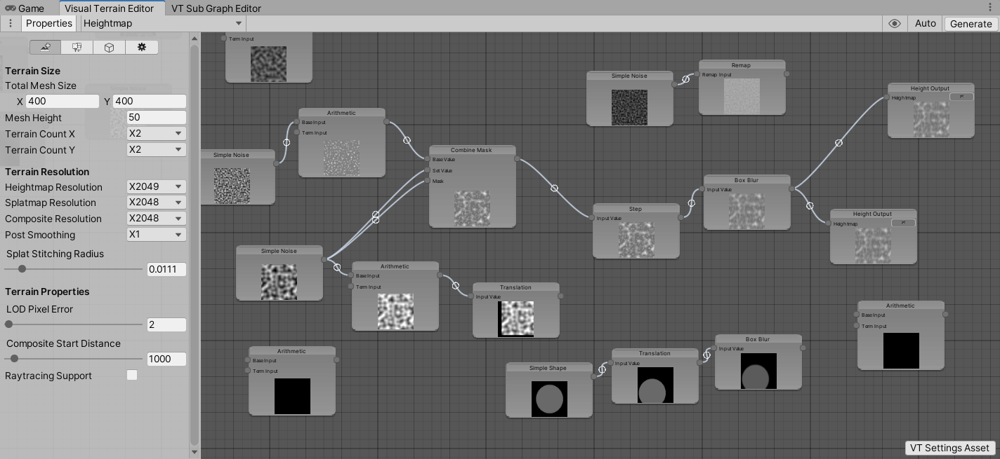
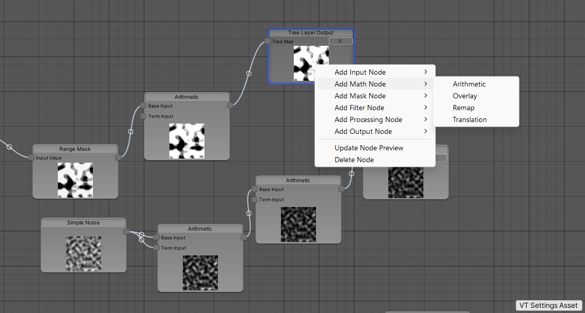
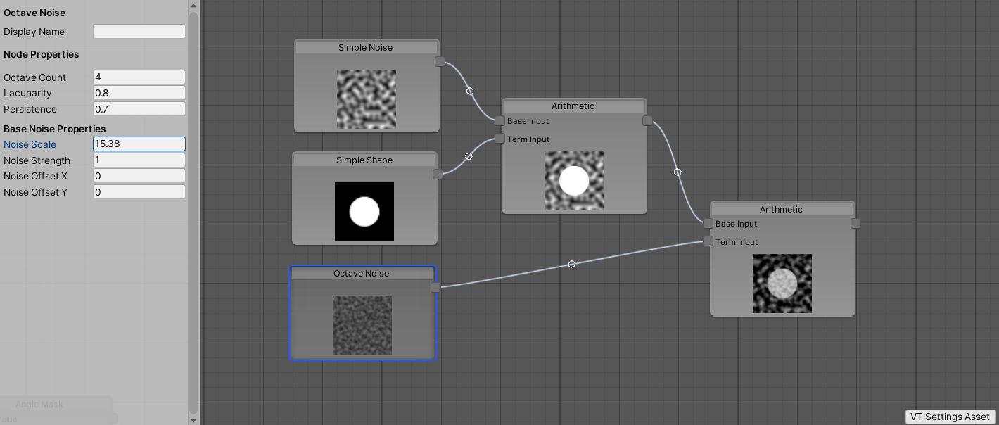
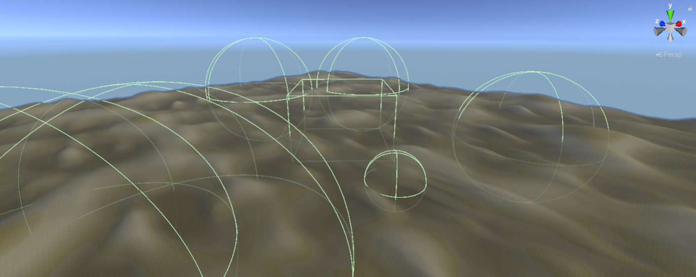
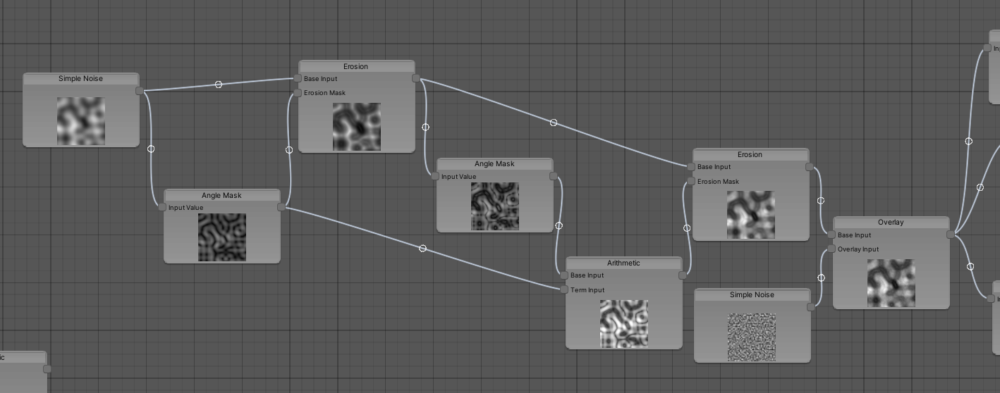
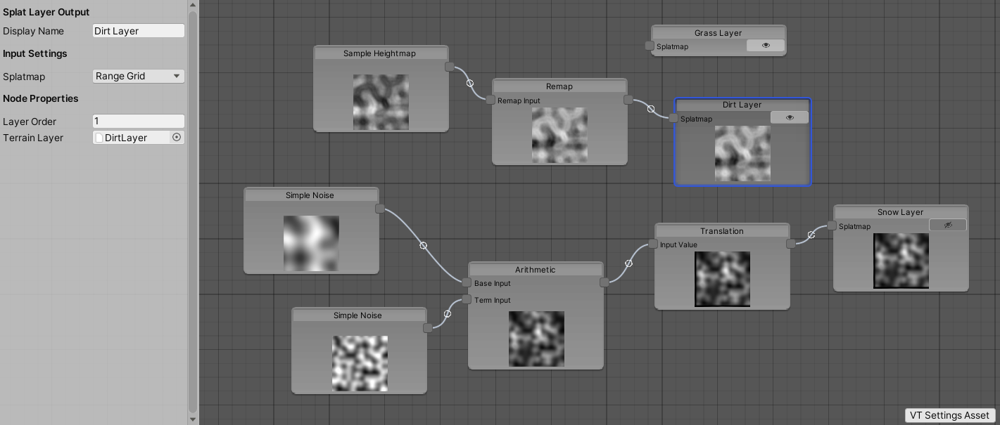
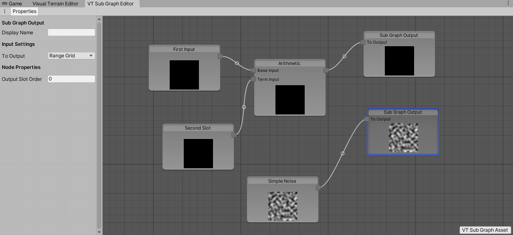
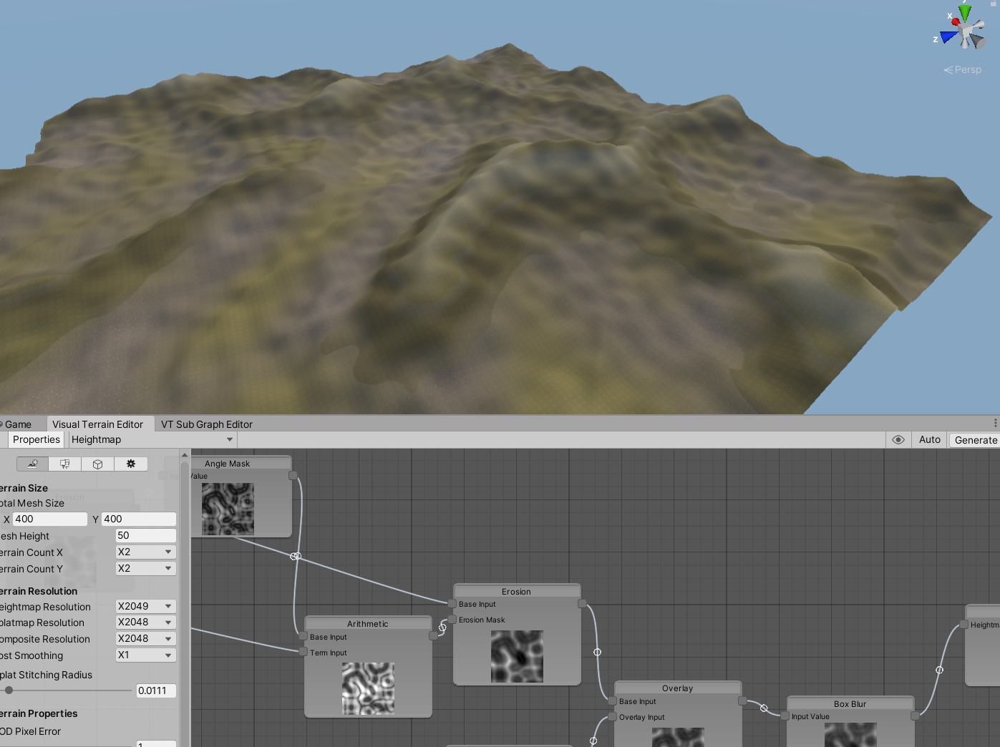

# Visual Terrain
An open-source node-based Terrain generator for Unity. Create stunning terrain shapes and paint them mathematically by combining nodes in a user-friendly graph interface!

## Overview

Visual Terrain is an open-source project aimed at giving developers a more professional non-destructive pipeline for creating procedural terrains at runtime or in the editor. There are two assemblies provided with the project:

- Visual Terrain Runtime
- Visual Terrain Editor

The Runtime assembly provides definitions of all of the required assets (including nodes, value types, and graphs) needed to define a Visual Terrain. It also includes the **Visual Terrain Manager** and necessary tools to procedurally generate the landscape based on a provided `VT Settings Asset`. The Editor assembly provides tools for editing terrain assets within the Unity Editor, such as the **Visual Terrain Editor** which allows you to click on and connect nodes within a visual graph. 

The Editor assembly is not included in builds and you should not use its API outside of the Editor. You can still construct and generate a Visual Terrain at runtime through code if you need that sort of control, but the plugin is primarily built to handle the case of pre-building a terrain for a large level or game world during development.

### Why Make Visual Terrain?

Several upcoming game ideas that I had involved needing to create a large variety of terrains, so I set out to find a suitable tool that would make this process easier. Previously, I would use Unity's [Terrain Tools](https://docs.unity3d.com/Packages/com.unity.terrain-tools@5.3/manual/index.html) to sculpt initial shapes and then iterate on them until I was satisfied. But looking at AAA production pipelines, I realized the benefit of a non-destructive workflow like the kind you'd get with Blender's geometry nodes or Houdini. 

There are already several great plugins that fill this gap such as [MagMagic](https://assetstore.unity.com/packages/tools/terrain/mapmagic-2-165180?srsltid=AfmBOoqc299cBaAZbVUn5PWV6s0SXcFSrj_-xlI7348W6XR4PmHqi4Jd) or [TerraForge](https://assetstore.unity.com/packages/tools/terrain/terraforge-2-procedural-terrain-generator-291432), but what I could find was either paid, closed source, or experienced issues with Unity 6. Other open source options I looked at felt underdeveloped or were non-node based, which can make visualizing changes a hassle with a complicated terrain shape. So as someone who is not deterred from building custom solutions to problems like this, I set out to build a generic, highly adaptable tool that could produce the terrains I was looking for with as much developer control as possible. This also helped me to understand the techniques involved in terrain generation and benefit from the control of totally understanding each step in the plugin. I built Visual Terrain from the ground up to assist with the development of an upcoming game, and it's now released for free to benefit the gamedev community!

## Usage

To get started, you first need to make a `VT Settings Asset` which sits in your Assets folder. It is a ScriptableObject which stores all of the data defining how a terrain should be generated and how objects should be placed on it. There are 3 different graph data structures (called a `VTGraph`) stored inside of the asset which you must work with to create a terrain: the `Heightmap` graph, the `Texture` graph, and the `Terrain Object` graph. 

For the generation to work, you must place and connect nodes within each graph that will tell the algorithm how your terrain will be built. You can do this in code (which is not documented yet), but that is quite complicated unless you understand how the system works under the hood. Instead, the user-friendly way to edit nodes is via the **Visual Terrain Editor**.

### The Visual Terrain Editor

This is a custom Editor window which can be used to edit a `VT Settings Asset`. You can open this panel by going to *Window->Visual Terrain->Visual Terrain Editor* or by double clicking a `VT Settings Asset`. A label at the bottom right of the screen will tell you which asset is currently being used by the editor.

You can inspect each of the graphs in your asset by using an enum dropdown at the top left. There is also a Properties toggle which brings up an inspector panel. When a node is selected, the panel will display all of the properties used to configure it. When there is no node selected, the panel will show properties used to customize the resolution, size, quality, and rendering data of your terrain.

### Graph View

Each `VTGraph` in your asset can be modified by manipulating the nodes from this main view. You can select nodes by **left clicking** on them, browse extended options with **right click**, delete nodes with the **delete or backspace key**, and expand or hide their preview image with the **E key**. You can focus the view on selected nodes with the **F key**.

To add new nodes, right click and select an Add Node option to create a node at your mouse cursor position. You can connect nodes by dragging from an input slot to an output slot, or the other way around. Each node will perform some processing operation on a value from an input slot (or generate a new input value) and then populate the output slot to be passed to the next node. There are two types of values supported currently:

- VT Range Grid
- Float

A **VT Range Grid** is a representation of a 2D grid of floating point values. You can think of this like a grayscale texture where each pixel can be any value between 0 and 1. Range Grids are used everywhere to define where things happen on your terrain, such as how tall it is at each point (from 0% to 100%) or what the percent chance is (from 0% to 100%) that a tree will be placed. The **Float** value type is a single floating point number. In order to use different value types, you can select the desired type from the node's properties for each input slot. For convenience, a preview image of the first output slot's Range Grid is shown as a texture in each node, where `0.0f` represents a black pixel, `0.5f` represents a pure gray pixel, and `1.0f` represents a white pixel.

### Input Nodes

To start building a VT Range Grid that will represent your terrain, you need to generate some initial values with these special Input Nodes. You can use a **Simple Shape Node** to create a basic shape like a rectangle or circle. There's also a **Simple Noise** node which allows you to generate Perlin noise at your desired scale and offset. Since the terrain generation occurs in specific order, you can sample final Heightmap from the Texture or Terrain Object graphs via a **Sample Heightmap Node**, which will be useful for painting terrains based on height.

To create more complicated shapes, you can use the **Group Shape Node** which utilizes Scene GameObjects to sculpt your terrain. For this to work, you must place a `VTSceneReferenceObject` component on a holder GameObject and give it a unique name. You can then reference this name in the properties of the shape node. When you load into a scene or change the name, the node will search for references in your scene and use them while processing. The *Terrain Holder Reference* object is the object that holds child terrains which the node uses as reference for positioning. The *Shape Group Holder Reference* object holds collision shapes. The only supported collision shapes currently are `SphereCollider` and `BoxCollider`. You can place objects with Sphere/Box Colliders directly on your terrain and the pixels they take up will be filled with the *Shape Value*. This allows you customize your terrain visually in a non-destructive fashion. Just be aware that the collision shapes need to be enabled and active in the hierarchy to work, so you may want to leave them on a collision layer that won't interfere with your game.

The **Octave Noise Node** is a shortcut node that automatically layers multiple instances of noise on top of each other. The *Lacunarity* value determines how much each layer shrinks, and the *Persistence* value determines how much influence each layer has over the final grid. You may want to compensate the overall brightness using the *Strength* value. This should help you get started quickly.

If you want even further control over the influence of specific points, you use a **Texture Node** to import a custom grayscale texture which will be converted into Range Grid format. The Red channel will be used for the resulting value.

### Other Node Types

There are plenty of operations you can perform with nodes such as Addition, Subtraction, and Multiplication with the **Arithmetic Node**, Step operations with the **Step Node**, Blur with the **Box Blur** node, and even a simple Erosion approximation with the **Erosion Node**. By manipulating the values within a VT Range Grid, you can alter the resulting terrain. For example, adding a value of `0.2f` to a heightmap grid value with the **Arithmetic Node** raises the entire terrain by 20% of the maximum height.

You can use a **Remap Node** to alter values from a certain range to another range. For example, you could use it to remap a sampled heightmap from `0.5f` to `1.0f` into `0.0f` to `1.0f`, which essentially makes all values below `0.5f` move towards 0 with some falloff. You could then use this in a Splatmap to paint a terrain texture like snow on all values above 50% of height.

One important set of nodes are the Mask Nodes. A mask is essentially a selected area of the VT Range Grid that can be used to apply an effect or operation within that area. A **Range Mask Node** will select all values within a designated range to become part of your mask. For example, you could use a **Range Mask Node** to select height values at `0.5f` with a `0.1f` tolerance and use that to paint a sand texture. Now all heights between 40% and 60% of the terrain max height will become sand. You can also use an **Angle Mask Node** to detect the slope/derivative of a heightmap. This will tell you which parts of your range grid are the most steep, and it is essential for use in the **Erosion Node** for example which erodes based on a mask input. Finally, you can use the **Combine Mask Node** to override a grid value with a different grid value depending on the provided mask. When the mask value is `0f`, 100% of the base value will be used. When it is `0.5f`, 50% of the base value will be used and 50% of the override value will be used. When it is `1f`, 100% of the override value will be used for the final output.

### Output Nodes

In order for terrains to know which final Range Grid value to use, some special output nodes are designated for each graph type. These nodes can be disabled so that they don't influence the generation algorithm, which is useful for debugging.

In the Heightmap graph, a **Height Output Node** is used to designate the final heightmap Range Grid. Values from 0 to 1 are used to mark how tall a point is. A value of 1 means that the height used will be the *Mesh Height* value specified in world units within the settings asset.

In the Texture graph, a **Splat Layer Output Node** is used to designate the influence of a single Terrain Layer. Values from 0 to 1 are used to mark the opacity of this layer. The layer order can be customized with the *Layer Order* setting in each node. Layers that are evaluated first will be applied as a base texture, and then layers above that will override the layers below. If the order matches another node, they will be sorted according to their Y position within the graph.

In the Terrain Object graph, a **Tree Layer Output Node** is used to define and place trees on the terrain. The *Density* setting lets you control how many trees are attempted to be placed per world unit. The *Jitter Range* setting controls how much each tree's position is randomized from its initial grid position. With the *Revalidate Position* field, you can check whether the new jittered position is also valid for placement, but with some extra leeway defined in the *Terrain Object Setup* tab in the asset properties. You can customize the range of values that are used to determine each instance's width, height, and rotation. You can also provide custom seed values for the random number generators used for each tree layer.

### Sub Graphs

A more advanced way to work involves creating a reusable graph structure called a Sub Graph. You can create a `VT Sub Graph Asset` and edit it with a dedicated **VT Sub Graph Editor** window. This generic graph has no understanding of heightmaps or splatmaps and instead uses simple **Sub Graph Input** and **Sub Graph Output** nodes. You can process the input in any way and return an output using these special nodes, though the preview images won't work correctly since there is currently no "fake preview value" to fall back on. In your main `VT Settings Asset`, you can add a **Sub Graph Node** and plug in the `VT Sub Graph Asset` as property. The input and output slots will dynamically change to reflect the sub graph's input and output nodes. You can then use it in a chain like any other node, and when the terrain is generated it will traverse all of the sub graph nodes as expected. 

Utilizing this workflow allows you to create one reusable component such as a crater and duplicate it several times throughout your terrain, reducing the overall work. You can use a **Translation Node** to position floating shapes, or set up an erosion chain that can be run multiple times to make older looking shapes. The power is in your hands to build a scalable system!

### Useful Tips

You can click and drag some asset types into the graph view to quickly create new nodes relevant to the object you dragged in. For example, you can drag a `TerrainLayer` asset into a Texture graph to create a **Splat Layer Output Node** with the layer set to your object. You can also drag a `GameObject` into a Terrain Object graph to create a **Tree Layer Output Node**, but be aware that if you use a Scene object, any reference to it will be lost if you unload the active scene, so you may want to use a `Prefab` from your assets folder instead.

### Generating Your Terrain

To utilize your `VT Settings Asset`, you need to add a `Visual Terrain Manager` component to a GameObject in your scene. This will serve as the holder object for everything that is generated and placed by Visual Terrain. It can be moved to any location in your world, but be aware that Unity does not support rotating terrains, so the package assumes no rotation. 

There are a few ways to trigger the terrain generation. The first and easiest way is to hit the *Generate* button within the Visual Terrain Editor window. This will find all manager objects and generate their terrains if their Settings Asset matches the one being inspected in the editor window. You could also use the Context Menu button within the "3 dots" dropdown from the Visual Terrain Manager. Lastly, you could call the public **GenerateTerrain()** function on a manager of your choice to generate its terrain.

When the terrain generates, the manager and associated interfaces will:

1. Create all of the needed terrain objects and place them into a holder object. If the terrains already exist and are referenced, it will reuse them so that no unused values/components are lost.
2. Read the value of the heightmap graph within the asset and then apply that value to each terrain's height data. Since there could be inaccuracies in the sampling process, stitching is performed along each terrain edge to ensure that there are no seams between terrains. To provide better results, a Post Smoothing step is performed depending on asset settings which will average out terrain height points after they are sampled from the graph. This allows you to utilize a lower resolution graph output on a higher resolution terrain. The heightmap value is stored in a cache for future use.
3. Calculate the splatmap layer values from the texture graph and apply those as alphamaps with your provided Terrain Layers. The splat layers also go through a seam removal process using the *Splat Stiching Radius* setting in the asset. The stitching radius determines what percent of the terrain size will be used to interpolate between terrain edges. A larger stitching radius will provide a smoother result at the cost of loss of detail at the edges. The splat layer values are stored in a cache for future use.
4. Place trees using the terrain object graph's values by creating a grid of instances and jittering them based on provided seed values. When the interface revalidates a tree position, it first jitters the instance and then checks if the new position is still within an acceptable range to prevent trees being placed in spots where they shouldn't go. If the tree is placed, the seed values you customized for each tree type are used to create random values for width, height, and rotation so that each instance appears more natural.

When this process is complete, you now have fully usable terrains with their TerrainData stored locally within the scene. Note that this is different from hand-made terrains which typically ask you to make terrain data in your assets folder. Since regeneration wipes the terrain data, there is no need to save it to your assets folder unless you wish to keep the results for later. At this point, you can modify the terrain by painting on it or changing its data, but be aware that regenerating will revert those changes. If you want to use Visual Terrain as a base for manual modifications, you may want to enable the **lockGeneration** bool within the Visual Terrain Manager so that you don't accidentally generate again. You could also just delete the manager so that Visual Terrain doesn't consider it at all.

## Limitations

**NOTE:** This project is in a prerelease state, and as such I cannot fully recommend it for production use unless you very clearly understand how it works and can live with the limitations.

The package has several open issues that have been left for later as they were not of highest priority yet.

- The auto-generate terrain feature does not work: Terrain generation can still be quite slow for the non-preview mode and it isn't threaded, so automatically building a terrain every time you change a property just isn't useful at this stage. If we were able to make the generation process a non-blocking call so that the editor can still be used while it's building, then this would make more sense.
- Scene-Dependent nodes such as the Group Shape Node can't tell when GameObjects have shifted around in a scene, so their thumbnail image won't automatically update: You can update it by pressing the "Refresh" button which was added to these nodes or by right clicking and selecting "Update Node Preview". Due to the slowness of long chain evaluations, even updating these every frame would be a bit heavy. They may need to keep track of scene/object changes or we may need to come up with a time-spliced operation instead of the blocking call that currently occurs from the "Update Output Connected Nodes" function (called when the node thumbnail needs to update).
- Graph evaluation is somewhat redundant and slow: If a node needs to be evaluated, it must evaluate the whole chain before it, even if the values haven't changed since the last evaluation. If they held some sort of memory and allow property changes to invalidate their outputs, we could avoid redundant recalls. However, Scene-Dependent nodes are not easily able to tell when they have been invalidated 
- Sub graphs can't include other sub graphs within them: Due to not being able to detect endless loops (i.e. a sub graph contains itself or contains a Sub Graph Node that contains itself) sub graphs have been limited to not allow Sub Graph Nodes. Essentially, this means you can't nest sub graphs to create highly reusable prefabs. This is probably a logic problem that could be solved by traversing all Sub Graph Node contents, which would free up this limitation.

As you can see, the main problems involved are with performance and incorrect visualizations, but outside of that the package should be reliable for generating consistent results. There are also a few useful features that should be added before the full release but have been skipped because I didn't need them right now.

- There is no support for placing detail objects
- There is no support for painting grass values
- Not all of the possible terrain data properties are accounted for in the VT Settings Asset, so you have to manually apply them to each generated terrain
- There is no support for placing custom GameObjects via RangeGrids

It would be great to tackle some of these subjects in the future once we understand the use cases better and potentially restructure some of the node processing steps. I will be updating Visual Terrain based on any issues I find while creating levels for my new game, which should provide some hands-on direction as to how the package will evolve.

## Other Details

The project is currently in a prerelease state, but will adhere to [Semantic Versioning](https://semver.org/). Each new release will be given a Tag which you can use to track changes.

## Installation

### Recommended Installation

If you're looking for any specific release of Visual Terrain, you can specify a release tag with the hashtag like so: "https://github.com/RobProductions/VisualTerrain.git#ReleaseNumber"

1. Open the [Package Manager](https://docs.unity3d.com/2020.3/Documentation/Manual/upm-ui.html) in Unity
2. Copy the GitHub "HTTPS Clone" URL for OpenEOS: [https://github.com/RobProductions/VisualTerrain.git](https://github.com/RobProductions/VisualTerrain.git)
3. Click the '+' icon and hit *"Add package from git URL"*
4. Paste the HTTPS Clone URL to the popup and (optionally) add on *#YourChosenReleaseNumer* to the end, then hit enter
5. Wait for download to complete
6. You can now create a *VT Settings Asset* and open it with the Visual Terrain Editor to start making your terrain!

### Optional Installations

**OpenUPM installation**

Check [this link](https://openupm.com/docs/getting-started.html#installing-a-upm-package) for the recommended steps.

**Local package installation**

Feel free to download the project as .zip and unzip the folder to somewhere on your local drive. Then use the *"Add package from disk"* option in the Package Manager to add this local package instead of the remote installation.

**Assets path installation**

Visual Terrain should also work as a part of your `Assets/` directory if you'd like to customize it for your specific project without having to deal with the package system. Simply download the project as a .zip and unzip the contents to anywhere in your Assets folder, as long as they are self-contained so that the Assembly Definition doesn't confuse itself with your other files. There should be no difference between Package and non-Package installation in terms of usage.

### Want more details about the API?

If you installed via Git, you may want to make sure that you've enabled the generate .csproj setting for "Git Packages" in *Edit->Preferences->External Tools*

## Contribution

Visual Terrain is supported by the original author RobProductions and the game development community.

### How to Contribute

This open source project is free for all to suggest improvements and submit pull requests. These are the recommended steps to add your contribution:

1. Fork the repository to your GitHub account
2. Clone the code to the Assets or local Packages folder in a testbed Unity project
3. Create a new branch or work off of your own "working branch"
4. When your changes are complete, submit a pull request to merge your code; ideally to the "working-branch" used to test changes before main
5. If the PR is approved, aggregate changes will eventually be merged into main and a new release tag is created

## Credits & Details

Created by [RobProductions](https://twitter.com/RobProductions). RobProductions' Steam games can be found [here](https://store.steampowered.com/developer/robproductions).

### Requirements

- Tested with Unity 2020.3.49f1 and .NET 4.x, though it will likely work in some earlier versions of Unity too. Parameters for Unity 6 terrains have been accounted for.
- Non-preview terrain generation can be slow on older machines, so be aware that the CPU's single thread capabilities are what determines how fast each node is evaluated (at least for now until we better utilize multi-cores).

### License

This work is licensed under the MIT License. The intent for this software is to provide a free and open tool for developers to create procedural terrains, without requirement of attribution. However, attribution for uses of this package would be much appreciated. The code may be considered "open source" and could include snippets from multiple collaborators. Contributors may be named in the README.md and Documentation files. 

The code is provided "as is" and without warranty. 
